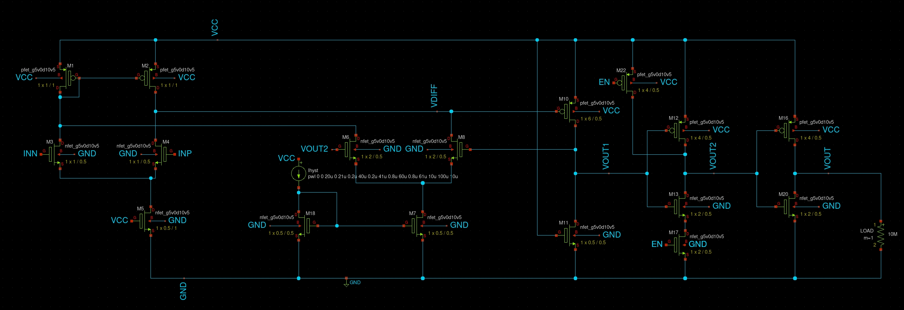

# Caravel Analog User - VCO IP, Comparator IP and Coil tests

  

---

# VCO
The VCO is a 7 inverter ring oscillator. It can operate from 120MHz to 350 MHz. It has two tap points for external capacitors that can further reduce the frequence range.

## Circuit
This is a ring oscillator with 7 invertors

### Inputs to the circuit
1. VCC - 3.3 v
2. GND - Ground
3. VADJ - Voltage to adjust the frequency output
4. OUT1 - A tap point to add a capacitor
5. OUT2 - Second tap point to add a capacitor to lower the frequency range.

### Output of the circuit
1. OUT - VCO output

## Simulations

With no external capacitors

Frequency range is 120 MHz to 350 MHz.

With 10 picoFarad External Capacitor 

Frequency range is 10 MHz to 40 MHz.

# Comparator
A comparator is a device that compares two analog inputs and outputs a digital signal indicating which input is larger. So it has two analog input terminals and one binary digital output. 
When the difference between two analog input signals approach zero, noise on the inputs will cause spurious switching of digital output. This rapid change in output due to noise can be prevented by hysteresis. Hysteresis is switching the output high or low at different input signal levels. In place of one switching point, hysteresis introduces two: one for rising edge, and one for falling edge of voltage or current. The difference between the higher-level trip value (VH) and the lower-level trip value (VL) equals the hysteresis voltage (HYST).

### Inputs to the circuit
1. VCC - 3.3 v
2. GND - Ground
3. INN - Negative differential input
4. INP - Positive differential input
5. EN  - Enable pin
6. Ihyst - Current to control hysteresis

### Output of the circuit
1. VOUT - Comparator output

### Circuit details
A comparator can be divided into three distinctive pieces – a frontend differential amplifier, amplifier stage and output stage.

# Coil Tests
The coil is from the PDK. The fasthenry file is generated. The simulation is ongoing...

## References
1. P. Horowitz,and W. Hill, “The Art of Electronics,” Cambridge Press University, 3rd ed (references) 
2. P. Furth, Y. Tsen, V. Kulkarni,and T. Raju, On the Design of Low-Power CMOS Comparators with Programmable Hysteresis., IEEE, 2010, pp.1077–1080.

